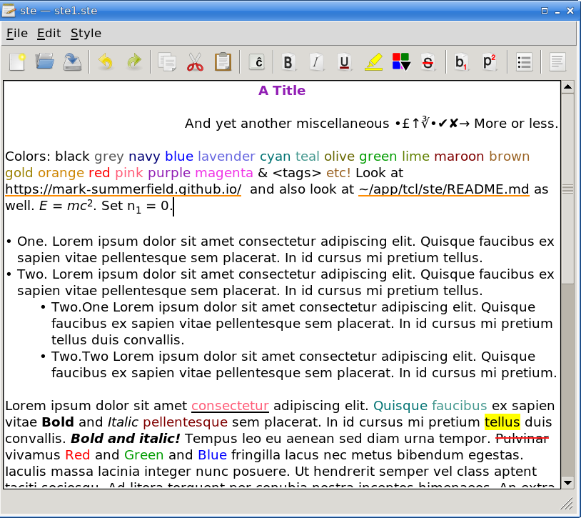

# Styled Text Edit — ste

A GUI Tcl/Tk styled text editor that supports bold, italic, color, etc.

ste supports conventional keyboard shortcuts, _Ctrl+I_ for italic, etc.

In addition, if you click _Style→Bullet List_ at the start of a line you'll
have a • inserted with indentation set, and on _Enter_ a new bullet etc. You
can get one extra level of indentation by pressing _Tab_ after a new bullet.
To finish with bullets, simply delete-backspace.

If you begin typing a word and press _Tab_ ste will attempt to do word
completion. This is based on a few hundred common English 5+ letter words
plus the words already present.

There is no support for numbered lists, for more than two levels of bullet
lists, or for images or tables.

The HTML import and export are very poor and printing only does plain text.

The load and save of files in .ste (ste's own format), .tkt (the Tcl/Tk text
widget's dump format), and .tktz (zlib deflated Tcl/Tk text widget dump
format) works with perfect fidelity.

Note: I use [Store](https://github.com/mark-summerfield/store) for version
control so github is only used to make the code public.

## Dependencies

Tcl/Tk >= 9.0.2; Tcllib >= 2.0; Tklib >= 0.9.

## License

GPL-3

---
