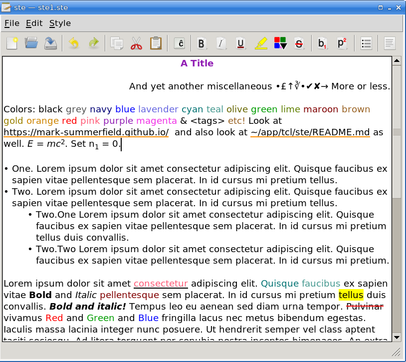

# Styled Text Edit — ste

A GUI Tcl/Tk styled text editor that supports bold, italic, color, etc.

ste supports conventional keyboard shortcuts, _Ctrl+I_ for italic, etc.

To get a bullet item use _Ctrl+Tab_ or for a plain indent _Tab_. To unindent
either use _Backspace_. If _Tab_ is used just after one or more letters
auto-completion is attempted. This is based on a few hundred common English
5+ letter words plus the words already present.

There is no support for numbered lists, for more than three levels of bullet
lists, or for images or tables. Only one—user-defineable—font family is
supported. (Supporting multiple fonts is perfectly possible but since I
don't need this I haven't added it.)

The HTML import and export are very poor and printing only does plain text.

The load and save of files in .ste (ste's own format), .tkt (the Tcl/Tk text
widget's dump format), and .tktz (zlib deflated Tcl/Tk text widget dump
format) works with perfect fidelity.

Note: I use [Store](https://github.com/mark-summerfield/store) for version
control so github is only used to make the code public.

Note: Claude AI was used for the import and export code (except for plain
text).

## Dependencies

Tcl/Tk >= 9.0.2; Tcllib >= 2.0; Tklib >= 0.9.

## License

GPL-3

---
